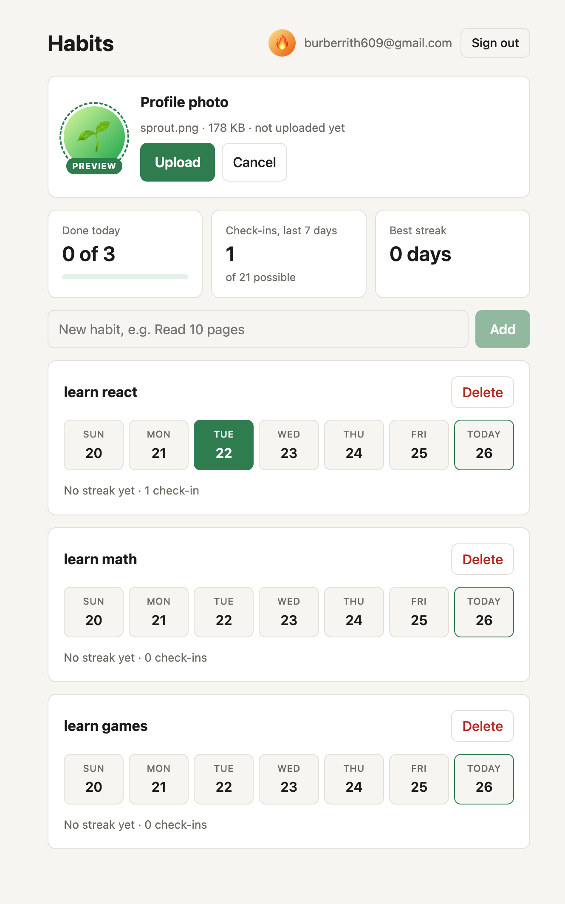
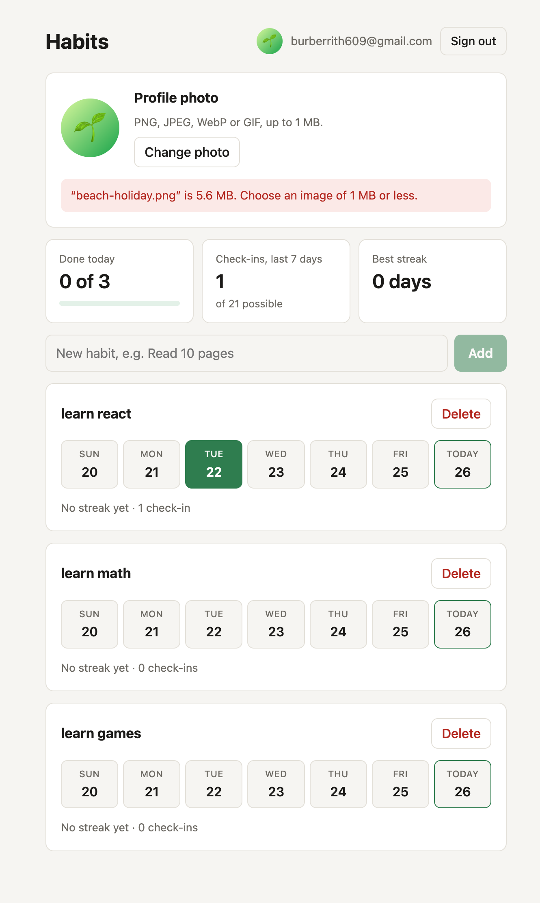
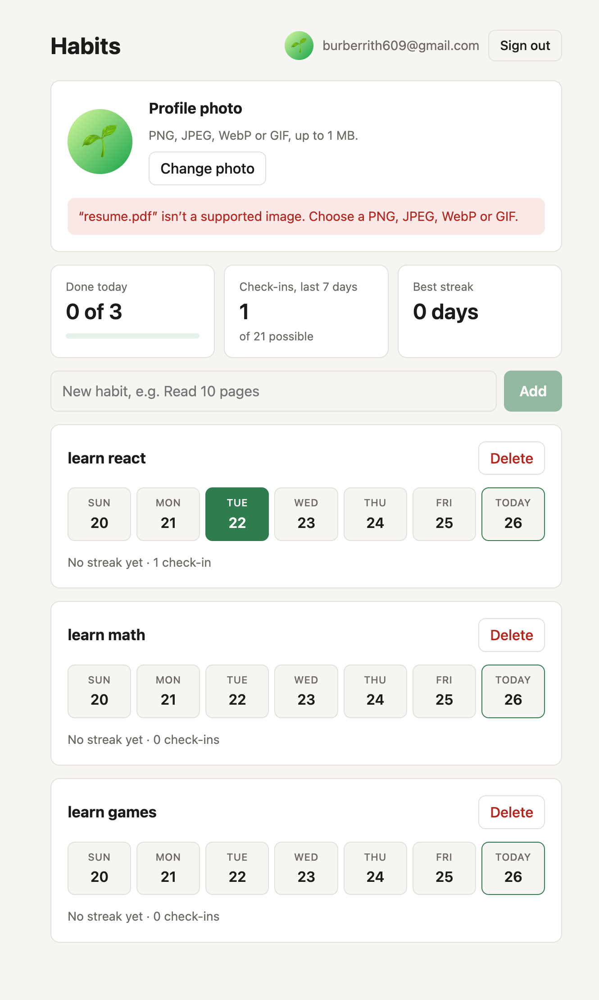
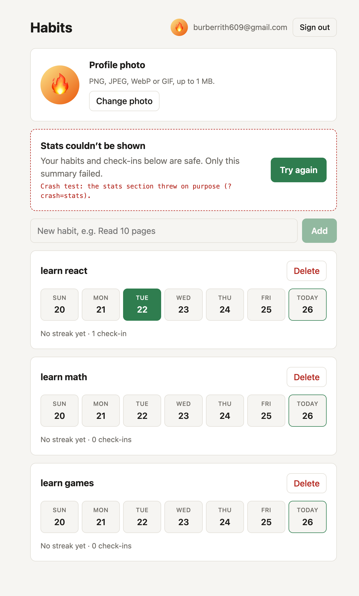
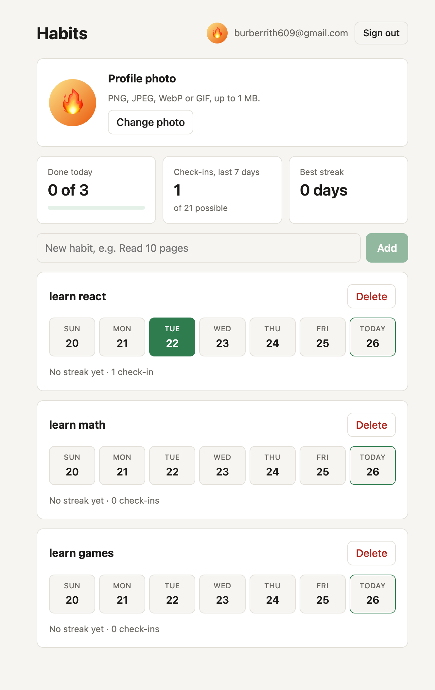

# Habit Tracker: avatar uploads + error boundaries

A React 19 + TypeScript (Vite) habit tracker on Supabase. This step adds two
things that make the app hold up against bad input and broken code:

1. **Avatar upload.** Pick an image, see a preview, and upload it to a public
   `avatars` bucket. Wrong types and files over 1 MB are refused politely,
   in the page. A storage policy keeps every user inside their own folder.
2. **Error boundaries.** The nav, profile photo, stats and habit list each sit
   in their own `ErrorBoundary`. If one crashes, only that section is replaced
   by its fallback card with a **Try again** button. The rest of the page keeps
   working.

It builds on the [Auth + RLS habit tracker](https://github.com/panharithhh/supabase-habit-tracker):
email sign-in, and RLS so each user only ever sees their own habits.

## Run it

```bash
npm install
cp .env.example .env    # then fill in the two values (see setup below)
npm run dev             # http://localhost:5173
npm run test:rls        # 29 tests: policies, storage policy, file checks. No Supabase project needed
npm run build           # tsc -b && vite build
```

## One-time Supabase setup

1. **Create a project** at <https://supabase.com/dashboard> → New project.
2. **Run the SQL.** SQL Editor → New query → paste all of
   [`supabase/schema.sql`](supabase/schema.sql) → Run. Then do the same with
   [`supabase/avatars.sql`](supabase/avatars.sql). This creates the `profiles`
   table, the `avatars` bucket and its storage policy.
3. **Make test accounts easy.** Authentication → Sign In / Providers → Email →
   turn **Confirm email** off.
4. **Copy the keys.** Project Settings → API Keys. Put the Project URL and the
   **publishable** key into `.env`. Never the secret / `service_role` key: it
   bypasses every policy, and Vite ships every `VITE_` variable to the browser.

## Avatar upload

The flow in [`AvatarUpload.tsx`](src/components/AvatarUpload.tsx) and
[`useProfile.ts`](src/lib/useProfile.ts):

1. **Pick a file.** The `accept` attribute filters the file picker, but anyone
   can switch it to "All files", so it isn't relied on.
2. **Validate it** with [`validateAvatar`](src/lib/avatar.ts). The file must be
   PNG, JPEG, WebP or GIF, and at most 1 MB (1,048,576 bytes). A rejected file
   gets an inline message naming the file and the problem, for example
   *“earth-wallpaper.png” is 5.8 MB. Choose an image of 1 MB or less.* SVG
   (it can carry scripts) and HEIC (most browsers can't show it) aren't allowed.
3. **Preview it.** `URL.createObjectURL(file)` shows the image before anything
   is uploaded, with a dashed ring and a *Preview* badge. The blob URL is
   revoked when the file changes or the card unmounts. If the file says it's
   an image but can't be decoded, the preview's `onError` rejects it too.
4. **Upload** to `avatars/<user id>/avatar` with `upsert: true`, so a new photo
   replaces the old one.
5. **Save** the public URL to `profiles.avatar_url`. The path never changes,
   so a `?v=<timestamp>` is added to get past cached copies of the old image.
6. **Render on mount.** On every page load, `useProfile` reads `avatar_url`
   from the database and the nav and profile card show it. If the image fails
   to load, they fall back to the email's first letter.

### Where the rules are enforced

| Rule | In the browser (UX) | On Supabase (security) |
|---|---|---|
| Images only | `validateAvatar` checks `file.type` | bucket `allowed_mime_types`: png, jpeg, webp, gif |
| At most 1 MB | `validateAvatar` checks `file.size` | bucket `file_size_limit`: 1048576 |
| Only your own folder | the app always uses `<your id>/avatar` | storage policy: `(storage.foldername(name))[1] = auth.uid()::text` |
| Only your own `avatar_url` | the app sends your id | `profiles` RLS: `auth.uid() = id` |

The storage policy, from [`supabase/avatars.sql`](supabase/avatars.sql):

```sql
create policy "Users manage avatars in their own folder"
  on storage.objects
  for all
  to authenticated
  using (
    bucket_id = 'avatars'
    and (storage.foldername(name))[1] = (select auth.uid()::text)
  )
  with check (
    bucket_id = 'avatars'
    and (storage.foldername(name))[1] = (select auth.uid()::text)
  );
```

`for all` matters: `upload` needs INSERT, but `upsert: true` also needs SELECT
and UPDATE. The bucket is **public**, which only means anyone with the URL can
*view* a file (as `` needs). Every write still has to pass the policy,
and nobody can list another user's folder.

## Error boundaries

[`ErrorBoundary`](src/components/ErrorBoundary.tsx) is a reusable class
component (`getDerivedStateFromError` + `componentDidCatch`). It takes a
`fallback` render function that receives `{ error, reset }`, and an optional
`onReset`. [`App.tsx`](src/App.tsx) wraps each section in its own boundary with
its own fallback copy:

| Section | Fallback says | Extra |
|---|---|---|
| Nav | The top bar didn't load | a **Sign out** button, so you're never stuck |
| Profile photo | Profile photo is unavailable | "Nothing was uploaded" |
| Stats | Stats couldn't be shown | "Your habits below are safe" |
| Habit list | Your habit list hit a problem | "Every check-in is saved" |

Every fallback has **Try again**, which re-renders the section. A last-resort
boundary in [`main.tsx`](src/main.tsx) wraps the whole app. The habit and
profile data live in hooks *above* the boundaries, so a crash and a retry never
lose what the other sections are showing.

Boundaries only catch errors thrown while rendering. Errors in event handlers
and async code, like a failed upload, are caught where they happen and shown
inline.

**See it yourself:** in `npm run dev`, open
`http://localhost:5173/?crash=stats` (or `nav`, `profile`, `habits`, or several
comma-separated). That section throws on purpose. **Try again** clears the
switch, so the retry works. The switch is behind `import.meta.env.DEV`, so
production builds don't contain it.

## Tests

`npm run test:rls` runs three files, with no Supabase project needed:

- [`scripts/avatars.test.mjs`](scripts/avatars.test.mjs) loads the real
  `supabase/avatars.sql` into an in-memory Postgres ([PGlite](https://pglite.dev))
  with stand-ins for Supabase's `auth` and `storage` schemas. As two users and
  a signed-out visitor, it checks that you can upload and upsert only in your
  own folder, can't overwrite, move, delete or list anyone else's files, can't
  upload outside a folder or to another bucket, and can only set your own
  `avatar_url`. If you remove the folder check from the policy, 5 of its 12
  tests fail.
- [`scripts/avatar-validation.test.mjs`](scripts/avatar-validation.test.mjs)
  checks `validateAvatar`: exactly 1 MB passes, one byte more fails, and PDF,
  text, SVG, HEIC and empty files are rejected.
- [`scripts/rls.test.mjs`](scripts/rls.test.mjs) is the habits RLS suite from
  the previous step.

The bucket's size and type limits are enforced by the Storage server, not
Postgres, so PGlite can't test them. They are set on the live bucket
(`file_size_limit`, `allowed_mime_types`) and apply to every upload, including
one that skips the app entirely.

### Checked on the live project

Signed in as a real user, these uploads went straight to the Storage API,
skipping `validateAvatar`:

| Direct upload | Supabase's answer |
|---|---|
| 5.6 MB PNG into your own folder | `The object exceeded the maximum allowed size` |
| PDF into your own folder | `mime type application/pdf is not supported` |
| PNG into another user's folder | `new row violates row-level security policy` |
| PNG outside any folder | `new row violates row-level security policy` |

After uploading two different photos through the app, the bucket holds one
object, `<your id>/avatar`: `upsert: true` replaced the first photo instead of
adding a second file.

## Deliverables

Screenshots are in [`docs/screenshots/`](docs/screenshots/).

**Preview before upload:** the chosen file, its size, and "not uploaded yet".



**Rejected files:** too big, and not an image.




**Avatar on a fresh load**, read back from `profiles.avatar_url`:


**A boundary in action:** the stats section throws (`?crash=stats`). Only its
card is replaced. The nav, profile and habit list keep working.



After **Try again**, the stats render normally:



**Why client-side validation is UX and the storage policy is the security:**

> Client-side validation runs in a browser the user controls and can be
> skipped with a single direct API call, so it only spares honest users a
> wasted upload and gives them a clear message, while the storage policy and
> bucket limits run on Supabase's servers for every request, whatever sent it,
> so they are what actually keeps bad files and other people's folders safe.

## Project layout

```
supabase/schema.sql               habits + habit_logs, grants, RLS
supabase/avatars.sql              profiles, avatars bucket, storage policy
scripts/*.test.mjs                policy and validation tests (npm run test:rls)
src/lib/avatar.ts                 file rules: types, 1 MB, path, messages
src/lib/useProfile.ts             load avatar_url on mount, upload + save
src/lib/useHabits.ts              habit reads and writes, shared by list and stats
src/lib/crashTest.ts              dev-only ?crash=<section> switch
src/components/ErrorBoundary.tsx  reusable class boundary
src/components/SectionFallback.tsx fallback card with Try again
src/components/AvatarUpload.tsx   pick, validate, preview, upload
src/components/Avatar.tsx         round avatar with a letter fallback
src/components/Nav.tsx            top bar with avatar and sign out
src/components/Stats.tsx          done today, last 7 days, best streak
src/components/HabitList.tsx      add, check in, delete
```
